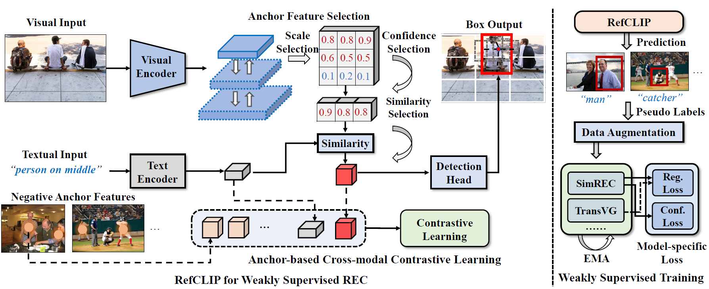

# RefCLIP
[](https://www.python.org/)


This is the official implementation of "RefCLIP: A Universal Teacher for 
Weakly Supervised Referring Expression Comprehension".
In this paper,we propose a novel one-stage contrastive model called
RefCLIP, which achieves weakly supervised REC via anchor-based cross-modal contrastive learning.
Based on RefCLIP, we propose a weakly supervised
training scheme for common REC models, that is, to
train any REC model by means of pseudo-labels.

<p align="center">
	
</p>

## Installation
- Clone this repo
```bash
git clone https://github.com/AnonymousPaperID5299/RefCLIP.git
cd RefCLIP
```

- Create a conda virtual environment and activate it
```bash
conda create -n refclip python=3.7 -y
conda activate refclip
```
- Install Pytorch following the [official installation instructions](https://pytorch.org/get-started/locally/)
- Install apex  following the [official installation guide](https://github.com/NVIDIA/apex)
- Compile the DCN layer:

```bash
cd utils/DCN
./make.sh
```

```bash
pip install -r requirements.txt
wget https://github.com/explosion/spacy-models/releases/download/en_vectors_web_lg-2.1.0/en_vectors_web_lg-2.1.0.tar.gz -O en_vectors_web_lg-2.1.0.tar.gz
pip install en_vectors_web_lg-2.1.0.tar.gz
```

## Data Preparation

- Download images and Generate annotations according to [SimREC](https://github.com/luogen1996/SimREC/blob/main/DATA_PRE_README.md).
- Download the pretrained weights of YoloV3 from [OneDrive](https://1drv.ms/u/s!Aka1OHHnFhDktBV8GWXVWiuVpqOY?e=fSmr4D).

- The project structure should look like the following:

```
| -- RefCLIP
     | -- data
        | -- anns
            | -- refcoco.json
            | -- refcoco+.json
            | -- refcocog.json
            | -- refclef.json
        | -- images
            | -- train2014
                | -- COCO_train2014_000000000072.jpg
                | -- ...
            | -- refclef
                | -- 25.jpg
                | -- ...
     | -- config
     | -- datasets
     | -- models
     | -- utils
```
- NOTE: our YoloV3 is trained on COCO’s training images, 
excluding those in RefCOCO, RefCOCO+, and RefCOCOg’s validation+testing. 


## RefCLIP

### Training
```
python train.py --config ./config/[DATASET_NAME].yaml
```

### Evaluation
```
python test.py --config ./config/[DATASET_NAME].yaml --eval-weights [PATH_TO_CHECKPOINT_FILE]
```

## Weakly Supervised Training Scheme
- Use RefCLIP to generate pseudo-labels. 
- Train model with pseudo-labels according to 
[RealGIN](https://github.com/luogen1996/SimREC), 
[SimREC](https://github.com/luogen1996/SimREC),
[TransVG](https://github.com/djiajunustc/TransVG) 
and [MattNet](https://github.com/lichengunc/MAttNet). 


## Model Zoo

### RefCLIP
<table class="tg" style="undefined;table-layout: fixed">
<colgroup>
<col style="width: 140px">
<col style="width: 60px">
<col style="width: 60px">
<col style="width: 60px">
<col style="width: 60px">
<col style="width: 60px">
<col style="width: 60px">
<col style="width: 100px">
<col style="width: 100px">
</colgroup>
<thead>
  <tr>
    <th class="tg-7btt"><span style="color:#000">Method</span></th>
    <th class="tg-7btt" colspan="3"><span style="color:#000">RefCOCO</span></th>
    <th class="tg-7btt" colspan="3"><span style="color:#000">RefCOCO+</span></th>
    <th class="tg-7btt"><span style="color:#000">RefCOCOg</span></th>
    <th class="tg-twlt"><span style="font-weight:600">ReferItGame</span></th>
  </tr>
</thead>
<tbody>
  <tr>
    <td class="tg-c3ow"></td>
    <td class="tg-c3ow"><span style="color:#000">val</span></td>
    <td class="tg-c3ow"><span style="color:#000"> testA</span></td>
    <td class="tg-c3ow"><span style="color:#000">testB</span></td>
    <td class="tg-c3ow"><span style="color:#000">val</span></td>
    <td class="tg-c3ow"><span style="color:#000"> testA</span></td>
    <td class="tg-c3ow"><span style="color:#000">testB</span></td>
    <td class="tg-c3ow"><span style="color:#000">val-g</span></td>
    <td class="tg-c3ow">test</td>
  </tr>
  <tr>
    <td class="tg-c3ow">RefCLIP</td>
    <td class="tg-c3ow"><span style="color:#000">60.36</span></td>
    <td class="tg-c3ow"><span style="color:#000">58.58</span></td>
    <td class="tg-c3ow"><span style="color:#000">57.13</span></td>
    <td class="tg-c3ow"><span style="color:#000">40.39</span></td>
    <td class="tg-c3ow"><span style="color:#000">40.45</span></td>
    <td class="tg-c3ow"><span style="color:#000">38.86</span></td>
    <td class="tg-c3ow"><span style="color:#000">47.87</span></td>
    <td class="tg-c3ow">39.58</td>
  </tr>
</tbody>
</table>

### Weakly Supervised Training Scheme

<table class="tg" style="undefined;table-layout: fixed">
<colgroup>
<col style="width: 140px">
<col style="width: 60px">
<col style="width: 60px">
<col style="width: 60px">
<col style="width: 60px">
<col style="width: 60px">
<col style="width: 60px">
<col style="width: 100px">
<col style="width: 100px">
</colgroup>
<thead>
  <tr>
    <th class="tg-7btt"><span style="color:#000">Method</span></th>
    <th class="tg-7btt" colspan="3"><span style="color:#000">RefCOCO</span></th>
    <th class="tg-7btt" colspan="3"><span style="color:#000">RefCOCO+</span></th>
    <th class="tg-7btt"><span style="color:#000">RefCOCOg</span></th>
    <th class="tg-twlt"><span style="font-weight:600">ReferItGame</span></th>
  </tr>
</thead>
<tbody>
  <tr>
    <td class="tg-c3ow"></td>
    <td class="tg-c3ow"><span style="color:#000">val</span></td>
    <td class="tg-c3ow"><span style="color:#000"> testA</span></td>
    <td class="tg-c3ow"><span style="color:#000">testB</span></td>
    <td class="tg-c3ow"><span style="color:#000">val</span></td>
    <td class="tg-c3ow"><span style="color:#000"> testA</span></td>
    <td class="tg-c3ow"><span style="color:#000">testB</span></td>
    <td class="tg-c3ow"><span style="color:#000">val-g</span></td>
    <td class="tg-c3ow">test</td>
  </tr>
  <tr>
    <td class="tg-0pky">RefCLIP_RealGIN</td>
    <td class="tg-c3ow">59.43</td>
    <td class="tg-c3ow">58.49</td>
    <td class="tg-c3ow">57.36</td>
    <td class="tg-c3ow">37.08</td>
    <td class="tg-c3ow">38.70</td>
    <td class="tg-c3ow">35.82</td>
    <td class="tg-c3ow">46.10</td>
    <td class="tg-c3ow">37.56</td>
  </tr>
  <tr>
    <td class="tg-0pky">RefCLIP_SimREC</td>
    <td class="tg-c3ow">62.57</td>
    <td class="tg-c3ow">62.70</td>
    <td class="tg-c3ow">61.22</td>
    <td class="tg-c3ow">39.13</td>
    <td class="tg-c3ow">40.81</td>
    <td class="tg-c3ow">36.59</td>
    <td class="tg-c3ow">45.68</td>
    <td class="tg-c3ow">42.33</td>
  </tr>
  <tr>
    <td class="tg-0pky">RefCLIP_TransVG</td>
    <td class="tg-c3ow"><span style="color:#000">64.08</span></td>
    <td class="tg-c3ow"><span style="color:#000">63.67</span></td>
    <td class="tg-c3ow"><span style="color:#000">63.93</span></td>
    <td class="tg-c3ow"><span style="color:#000">39.32</span></td>
    <td class="tg-c3ow"><span style="color:#000">39.54</span></td>
    <td class="tg-c3ow">36.29</td>
    <td class="tg-c3ow">45.70</td>
    <td class="tg-c3ow">42.64</td>
  </tr>
  <tr>
    <td class="tg-0pky">RefCLIP_MattNet</td>
    <td class="tg-c3ow">69.31</td>
    <td class="tg-c3ow">67.23</td>
    <td class="tg-c3ow">71.27</td>
    <td class="tg-c3ow">43.01</td>
    <td class="tg-c3ow">44.80</td>
    <td class="tg-c3ow">41.09</td>
    <td class="tg-c3ow">51.31</td>
    <td class="tg-c3ow">-</td>
  </tr>
</tbody>
</table>

## Citation
```BibTeX
@InProceedings{Jin_2023_CVPR,
    author    = {Jin, Lei and Luo, Gen and Zhou, Yiyi and Sun, Xiaoshuai and Jiang, Guannan and Shu, Annan and Ji, Rongrong},
    title     = {RefCLIP: A Universal Teacher for Weakly Supervised Referring Expression Comprehension},
    booktitle = {Proceedings of the IEEE/CVF Conference on Computer Vision and Pattern Recognition (CVPR)},
    month     = {June},
    year      = {2023},
    pages     = {2681-2690}
}
```
## Acknowledgement

Thanks a lot for the nicely organized code from the following repos
- [SimREC](https://github.com/luogen1996/SimREC)
